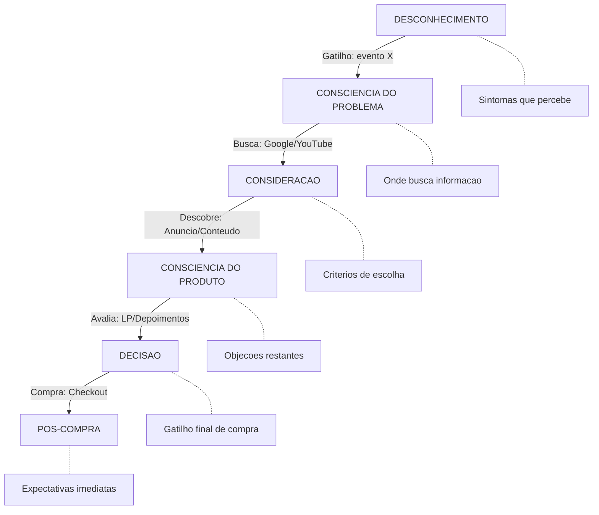

# Metodo Raio-X de Persona — 30 Camadas da Mente + Buyer Persona + ICP

Esta skill produz o raio-x completo do cliente: nao para na demografia de superficie, ela
desce ate as camadas mentais que de fato disparam compra, atencao e mudanca de
comportamento. Cada persona reune as **30 Camadas da Mente do Cliente** (10 insights por
camada = 300+ pontos de leitura), uma Buyer Persona pronta para funil, o ICP, o Mapa de
Empatia e a Anti-Persona.

Bordao da casa: persona boa nao e a que parece bonita no slide — e a que faz o cliente
sentir que voce leu a mente dele. Movimento gera resultado: persona so vale quando vira copy,
anuncio e oferta.

## Arvore de Decisao

```
Pedido do Usuario
|
|-- "persona profunda" / "30 camadas" / "raio-x da mente" / "perfil psicologico completo"
|   --> Fluxo 1: Persona Profunda Completa (30 Camadas)
|
|-- "buyer persona" / "avatar" / "perfil do cliente"
|   --> Fluxo 2: Buyer Persona Estrategica
|
|-- "ICP" / "cliente ideal" / "perfil ideal"
|   --> Fluxo 3: ICP (Ideal Customer Profile)
|
|-- "mapa de empatia" / "empatia" / "o que pensa e sente"
|   --> Fluxo 4: Mapa de Empatia Expandido
|
|-- "anti-persona" / "quem NAO e meu cliente"
|   --> Fluxo 5: Anti-Persona
|
|-- "tudo" / "completo" / "pacote completo"
|   --> Fluxo 6: Pacote Completo (todos os fluxos)
|
|-- "visual" / "entregaveis" / "persona card" / "deck" / "PDF persona"
|   --> Fluxo 7: Entregaveis Visuais
```

Se o usuario pedir apenas "persona" sem especificar, executar Fluxo 6 (Pacote Completo).
Fluxo 7 e executado AUTOMATICAMENTE ao final do Fluxo 6, ou sob demanda isoladamente.

---

## Passo 0: Levantar o Nucleo do Produto (OBRIGATORIO — antes de qualquer fluxo)

Sem materia-prima real, persona vira ficcao bonita. Antes de gerar qualquer coisa, coletar:

### Informacoes Obrigatorias

| Campo | Pergunta | Exemplo |
|-------|----------|---------|
| **Produto/Servico** | O que voce vende? | "Mentoria de IA para consultores" |
| **Faixa de preco** | Qual o investimento? | "R$ 2.997 a vista ou 12x R$ 297" |
| **Transformacao prometida** | Qual o resultado final? | "Dobrar faturamento usando IA em 90 dias" |
| **Nicho/Mercado** | Em que area atua? | "Consultoria de negocios" |
| **Publico principal** | Quem compra hoje (ou deveria)? | "Consultores independentes, 30-50 anos" |

### Informacoes Opcionais (enriquecem o resultado)

| Campo | Pergunta |
|-------|----------|
| **Ticket medio do cliente** | Quanto o cliente do SEU cliente cobra? |
| **Objecoes mais comuns** | O que dizem antes de comprar? |
| **De onde vem** | Trafego pago? Organico? Indicacao? |
| **Concorrentes** | Quem mais resolve o mesmo problema? |
| **Depoimentos** | Tem prints/textos de clientes? (Colar aqui) |
| **Tempo no mercado** | Ha quanto tempo vende isso? |

**Regra:** Se o usuario ja forneceu essas informacoes em contexto anterior ou em blueprint, extrair automaticamente sem perguntar novamente.

**Regra anti-alucinacao (CRITICO — leia antes de gerar qualquer coisa):**

Se faltar QUALQUER informacao do Passo 0 (obrigatoria ou opcional critica como **genero predominante real, faixa real de faturamento dos clientes atuais, top 3 nichos cabeca-de-lanca, religiao predominante, depoimentos reais, influenciadores que o publico realmente segue**), voce DEVE:

1. **PARAR a geracao** e perguntar ao usuario item a item
2. NUNCA inventar dados demograficos, psicograficos, comportamentais ou estatisticas (ex: "70% homens", "maioria cristao", "12 setores tipicos") sem base real
3. Se mesmo apos perguntar o dado nao estiver disponivel, marcar EXPLICITAMENTE no documento gerado como `[HIPOTESE A VALIDAR]` em destaque, para o usuario saber o que precisa confirmar antes de usar em copy/anuncio
4. Tabelas como "Proximos Passos Recomendados" so podem citar skills que voce CONFIRMOU que existem (listar `.claude/skills/` antes). Nunca inventar nome de skill.

**Por que essa regra existe:** output denso de aparencia profissional sem base de dados real e o PIOR tipo de entrega — o cliente vai gerar copy/anuncio em cima do dado falso e queimar dinheiro de trafego com publico errado. Precisao > volume. Admitir gap > inventar.

---

## Fluxo 1: Persona Profunda — As 30 Camadas da Mente do Cliente

Para CADA uma das 30 camadas abaixo, gerar 10 insights ESPECIFICOS ao produto/nicho coletado
no Passo 0. O detalhamento de cada camada (definicao, uso em copy e prompt-guia) esta em
[references/dimensoes-psicologicas.md](references/dimensoes-psicologicas.md).

### As 30 Camadas (5 niveis de profundidade)

**Nivel 1 — O Que Trava: Medos e Feridas (Camadas 1-6)**
1. Vazio de Proposito — A sensacao de "para que tudo isso?"
2. Medo que Paralisa — O terror que impede de agir
3. Inseguranca Nao Dita — O que pensa mas nunca confessa
4. Terror de Base — O medo que existe antes de qualquer racionalizacao
5. Heranca Familiar — Padroes e travas que vieram de casa
6. Cicatriz do Passado — A humilhacao ou rejeicao que ainda guia as escolhas

**Nivel 2 — O Que Move: Desejos e Vontades (Camadas 7-12)**
7. Motor da Decisao — O que de fato dispara a compra (nao o que ele diz)
8. Sonho Engavetado — O caminho que quase seguiu e ainda assombra
9. Vontade Secreta — O desejo que tem vergonha de admitir
10. Desejo de Verdade — A transformacao real por tras da compra
11. O Que Precisa Ouvir — A frase que daria alivio imediato
12. Busca de Uma Vida — A pergunta que ele persegue ha anos

**Nivel 3 — O Que Sabota: Padroes e Defesas (Camadas 13-18)**
13. Compensacao Automatica — O que faz "demais" para tapar uma falta
14. Escudo Emocional — Como se protege de uma nova decepcao
15. Fuga e Anestesia — O que compra/faz para se sentir melhor por um instante
16. Loop que se Repete — O ciclo que ele revive sem entender
17. Crenca que Prende — O "eu nao consigo" / "eu nao sou" gravado na mente
18. Regra Inventada — A limitacao que ele criou e acha que e real

**Nivel 4 — Quem Ela Acha que E: Identidade e Controle (Camadas 19-24)**
19. Mascara x Verdade — Quem ele finge ser vs. quem realmente e
20. Relacao com o Controle — Quer liderar ou quer nao ter chefe?
21. Marca do Trabalho — A experiencia profissional que ainda doi
22. Sindrome de Fraude — Onde ele se sente um impostor
23. Relacao que Drena — Quem suga a energia dele de forma recorrente
24. Dilema de Valor — Onde o que ele PRECISA briga com o que ele QUER

**Nivel 5 — A Dor Mais Funda: Sentido e Existencia (Camadas 25-30)**
25. Falta Sem Nome — A incompletude que ele nao consegue descrever
26. Medo do Proprio Poder — O que ele teme se realmente se tornar grande
27. Dor que Nao e Dinheiro — A ferida que nenhuma venda resolve
28. Vertigem da Liberdade — O peso de ter opcoes e responsabilidade
29. Contradicao Interna — Os dois desejos opostos que ele carrega ao mesmo tempo
30. Forcas Opostas — As polaridades que puxam ele para lados diferentes

### Formato de Saida (para cada camada)

```markdown
### [Numero]. [Nome da Camada]
> [Descricao curta da camada]

1. [Insight especifico e contextualizado ao nicho]
2. [Insight especifico e contextualizado ao nicho]
3. [Insight especifico e contextualizado ao nicho]
4. [Insight especifico e contextualizado ao nicho]
5. [Insight especifico e contextualizado ao nicho]
6. [Insight especifico e contextualizado ao nicho]
7. [Insight especifico e contextualizado ao nicho]
8. [Insight especifico e contextualizado ao nicho]
9. [Insight especifico e contextualizado ao nicho]
10. [Insight especifico e contextualizado ao nicho]
```

**Regra Critica:** Cada insight deve ser ESPECIFICO ao nicho/persona, nunca generico. Linguagem emocional e concreta, como se voce estivesse lendo a mente da persona em voz alta.

### Resumo Executivo das 30 Camadas

Apos gerar todas, produzir:

```markdown
## Resumo Executivo — Raio-X da Mente da Persona

**Nome ficticio:** [Nome]
**Frase que define:** "[Uma frase que captura a essencia]"

### Top 5 Dores Mais Profundas
1. [Dor + camada de origem]
2. ...

### Top 5 Desejos Mais Intensos
1. [Desejo + camada de origem]
2. ...

### Top 5 Gatilhos de Decisao
1. [O que faria essa persona comprar AGORA]
2. ...

### Palavras e Frases que Essa Persona Usa
- "[Frase interna 1]"
- "[Frase interna 2]"
- "[Frase interna 3]"
- "[Frase interna 4]"
- "[Frase interna 5]"

### Palavras e Frases que Fazem Essa Persona PARAR de Rolar o Feed
- "[Headline 1]"
- "[Headline 2]"
- "[Headline 3]"
```

---

## Fluxo 2: Buyer Persona Estrategica

Carregar [references/buyer-persona-framework.md](references/buyer-persona-framework.md).

### Secao 1: Perfil Demografico

| Campo | Detalhe |
|-------|---------|
| Nome ficticio | Nome que represente o segmento |
| Idade | Faixa e idade tipica |
| Genero | Predominante no segmento |
| Localizacao | Cidade/regiao tipica |
| Estado civil | Situacao familiar |
| Filhos | Quantidade e idades |
| Escolaridade | Nivel de formacao |
| Renda mensal | Faixa salarial |
| Profissao/Cargo | Posicao atual |
| Empresa/Porte | Tipo de organizacao |

### Secao 2: Perfil Psicografico

| Campo | Detalhe |
|-------|---------|
| Valores centrais | 5 valores que guiam decisoes |
| Estilo de vida | Como organiza seu dia |
| Hobbies e interesses | Fora do trabalho |
| Fontes de informacao | Onde consome conteudo |
| Redes sociais ativas | Quais e como usa |
| Influenciadores que segue | Referencias no nicho |
| Livros/podcasts favoritos | Conteudo que consome |
| Marcas que admira | E por que |

### Secao 3: Jornada do Comprador

```
DESCONHECIMENTO
  "Nem sei que tenho esse problema"
  -> [Situacao especifica]
        |
        v
CONSCIENCIA DO PROBLEMA
  "Sei que algo esta errado mas nao sei o que"
  -> [Sintomas que percebe]
        |
        v
CONSIDERACAO
  "Estou buscando solucoes"
  -> [Onde busca / o que pesquisa]
        |
        v
DECISAO
  "Estou comparando opcoes"
  -> [Criterios de escolha]
        |
        v
COMPRA
  "Decidi comprar"
  -> [Gatilho final + objecoes restantes]
        |
        v
POS-COMPRA
  "Comprei, e agora?"
  -> [Expectativas imediatas]
```

### Secao 4: Dores, Desejos e Objecoes (Framework DxDxO)

**Dores (Top 10):**

| # | Dor | Intensidade (1-10) | Frequencia | Impacto na vida |
|---|-----|-------------------|------------|----------------|
| 1 | [Dor especifica] | [X] | [Diaria/Semanal/Mensal] | [Como afeta] |
| ... | ... | ... | ... | ... |

**Desejos (Top 10):**

| # | Desejo | Urgencia (1-10) | Disposicao a pagar | Resultado esperado |
|---|--------|-----------------|-------------------|--------------------|
| 1 | [Desejo especifico] | [X] | [Baixa/Media/Alta] | [O que espera] |
| ... | ... | ... | ... | ... |

**Objecoes (Top 10):**

| # | Objecao | Tipo | Resposta-chave | Prova necessaria |
|---|---------|------|---------------|-----------------|
| 1 | "[Objecao exata]" | [Preco/Tempo/Confianca/Capacidade] | [Como rebater] | [Que evidencia convence] |
| ... | ... | ... | ... | ... |

### Secao 5: Mapa de Influencia

```
QUEM INFLUENCIA A DECISAO DE COMPRA:

Influencia POSITIVA (empurra para comprar):
  [+] Parceiro(a) -> [Como influencia]
  [+] Colega de profissao -> [Como influencia]
  [+] Mentor/Coach -> [Como influencia]
  [+] Comunidade online -> [Como influencia]

Influencia NEGATIVA (puxa para nao comprar):
  [-] Familiar cetico -> [O que diz]
  [-] Amigo que "ja tentou" -> [O que diz]
  [-] Comentario negativo online -> [Efeito]

DECISOR FINAL: [Quem bate o martelo]
```

### Secao 6: Comportamento Digital

| Metrica | Detalhe |
|---------|---------|
| Horarios online | Quando esta ativo |
| Tipo de conteudo que engaja | Video curto / Post longo / Carrossel / Stories |
| Formato preferido de aprendizado | Video / Texto / Audio / Ao vivo |
| Trigger de clique | O que faz clicar num anuncio |
| Trigger de compra | O que faz comprar de fato |
| Device principal | Mobile / Desktop |
| Tempo medio de decisao | Da descoberta a compra |
| Ticket maximo sem "pensar" | Valor que paga por impulso |
| Ticket que precisa "convencer" | Valor que precisa justificar |

### Secao 7: Um Dia na Vida (Narrativa)

Escrever uma narrativa de ~300 palavras descrevendo um dia tipico da persona, desde quando acorda ate quando dorme, incluindo:
- Momentos de frustracao (onde o produto poderia ajudar)
- Momentos de scroll no celular (onde um anuncio poderia aparecer)
- Conversas com pessoas proximas (sobre o problema)
- Momento de "seria tao bom se..." (desejo latente)

---

## Fluxo 3: ICP — Ideal Customer Profile

Carregar [references/icp-framework.md](references/icp-framework.md).

### 3.1 Perfil Firmografico (se B2B)

| Atributo | Ideal | Aceitavel | Desqualifica |
|----------|-------|-----------|-------------|
| Segmento | [Ex: Consultoria] | [Ex: Coaching] | [Ex: Ecommerce puro] |
| Porte | [Ex: 1-10 funcionarios] | [Ex: Solopreneur] | [Ex: +500 funcionarios] |
| Faturamento | [Ex: R$50k-500k/mes] | [Ex: R$20-50k/mes] | [Ex: <R$5k/mes] |
| Maturidade digital | [Ex: Tem site e redes] | [Ex: So Instagram] | [Ex: Nenhuma presenca] |
| Localizacao | [Ex: Capitais BR] | [Ex: Interior SP/MG] | [Ex: Fora do Brasil] |

### 3.2 Perfil Individual (se B2C)

| Atributo | Ideal | Aceitavel | Desqualifica |
|----------|-------|-----------|-------------|
| Renda | [Faixa ideal] | [Faixa aceitavel] | [Faixa que desqualifica] |
| Experiencia | [Nivel ideal] | [Nivel aceitavel] | [Nivel que desqualifica] |
| Urgencia | [Alta: precisa resolver agora] | [Media: quer melhorar] | [Baixa: "um dia quem sabe"] |
| Investimento anterior | [Ja investiu em solucoes] | [Primeiro investimento] | [Nunca pagou por nada] |
| Capacidade de execucao | [Implementa rapido] | [Precisa de suporte] | [Nao vai implementar] |

### 3.3 Sinais de Qualificacao (Lead Scoring)

```
SINAIS QUENTES (prontos para comprar):
  [+5] [Sinal especifico do nicho]
  [+4] [Sinal especifico do nicho]
  [+3] [Sinal especifico do nicho]
  [+3] [Sinal especifico do nicho]
  [+2] [Sinal especifico do nicho]

SINAIS MORNOS (precisam de nurturing):
  [+1] [Sinal especifico]
  [+1] [Sinal especifico]

SINAIS FRIOS (desqualificadores):
  [-5] [Red flag especifico]
  [-3] [Red flag especifico]
  [-2] [Red flag especifico]
```

### 3.4 Frase de Qualificacao Rapida

> "Meu cliente ideal e [profissao/situacao] que [dor principal] e quer [resultado desejado] nos proximos [timeframe], e esta disposto(a) a investir [faixa] para conseguir isso."

---

## Fluxo 4: Mapa de Empatia Expandido

Gerar o canvas completo com 6 quadrantes + expansoes:

```
+-----------------------------------------------------+
|                    O QUE PENSA E SENTE?             |
|  (Preocupacoes, aspiracoes, duvidas internas)       |
|  1. [Pensamento recorrente]                         |
|  2. [Pensamento recorrente]                         |
|  3. [Pensamento recorrente]                         |
|  4. [Pensamento recorrente]                         |
|  5. [Pensamento recorrente]                         |
+----------------------+------------------------------+
|   O QUE VE?         |    O QUE OUVE?               |
|  (Ambiente, mercado, |  (Influencias, midia,        |
|   concorrentes, feed)|   amigos, familia)           |
|  1.                  |  1.                          |
|  2.                  |  2.                          |
|  3.                  |  3.                          |
|  4.                  |  4.                          |
|  5.                  |  5.                          |
+----------------------+------------------------------+
|              O QUE DIZ E FAZ?                       |
|  (Comportamento publico, atitude, aparencia)        |
|  1.                                                 |
|  2.                                                 |
|  3.                                                 |
|  4.                                                 |
|  5.                                                 |
+-------------------------+---------------------------+
|       DORES             |       GANHOS              |
|  (Medos, frustracoes,   |  (Desejos, necessidades,  |
|   obstaculos)           |   medidas de sucesso)     |
|  1.                     |  1.                       |
|  2.                     |  2.                       |
|  3.                     |  3.                       |
|  4.                     |  4.                       |
|  5.                     |  5.                       |
+-------------------------+---------------------------+
```

### Expansoes do Mapa de Empatia

**7o Quadrante — O que PESQUISA no Google/YouTube:**
- 10 buscas exatas que essa persona faria

**8o Quadrante — O que COMENTA nas redes sociais:**
- 5 tipos de comentarios que deixaria em posts sobre o tema

**9o Quadrante — O que CONTA para amigos sobre o problema:**
- 5 frases exatas que diria num desabafo

**10o Quadrante — O que NAO ADMITE publicamente:**
- 5 verdades internas que nunca postaria

---

## Fluxo 5: Anti-Persona

Definir quem NAO e o cliente ideal — essencial para nao desperdicar verba de anuncio e energia de atendimento.

### Perfil da Anti-Persona

| Campo | Descricao |
|-------|----------|
| Nome ficticio | [Nome] |
| Por que NAO e cliente | [Razao principal] |
| Comportamento tipico | [Como age] |
| O que diz | "[Frase tipica]" |
| Red flags na conversa | [Sinais de alerta] |

### 5 Perfis de Anti-Persona

Para cada perfil:
```markdown
#### Anti-Persona [N]: "[Apelido]"
**Quem e:** [Descricao em 1 frase]
**Por que nao compra (ou nao deveria):** [Razao]
**Frase tipica:** "[O que diz]"
**Como identificar cedo:** [Red flags]
**Custo de atender esse perfil:** [Tempo/energia/reembolso]
```

### Filtros de Exclusao para Anuncios

```
EXCLUIR de campanhas pagas:
  - [Interesse/comportamento a excluir]
  - [Faixa etaria a excluir]
  - [Localizacao a excluir]
  - [Palavra-chave negativa]
  - [Audiencia a excluir]
```

---

## Fluxo 6: Pacote Completo

Executar TODOS os fluxos na seguinte ordem:

1. **Passo 0** — Levantar nucleo do produto
2. **Fluxo 2** — Buyer Persona Estrategica (estabelece a base demografica/psicografica)
3. **Fluxo 1** — Persona Profunda 30 Camadas (mergulho psicologico)
4. **Fluxo 4** — Mapa de Empatia Expandido (sintese visual)
5. **Fluxo 3** — ICP (criterios de qualificacao)
6. **Fluxo 5** — Anti-Persona (quem excluir)
7. **Consolidacao Final** — Documento unificado
8. **Fluxo 7** — Entregaveis Visuais (Persona Card, Deck, Mapa de Empatia, PDF)

### Consolidacao Final

```markdown
# Persona Master — [Nome do Produto/Servico]
Data: [Data de geracao]

## Resumo Executivo (1 pagina)
- Quem e o cliente ideal em 3 frases
- Top 3 dores que o produto resolve
- Top 3 desejos que o produto realiza
- Frase de qualificacao rapida
- Ticket medio e ciclo de venda

## Buyer Persona
[Output do Fluxo 2]

## Raio-X da Mente — 30 Camadas
[Output do Fluxo 1]

## Mapa de Empatia
[Output do Fluxo 4]

## ICP — Perfil do Cliente Ideal
[Output do Fluxo 3]

## Anti-Personas
[Output do Fluxo 5]

## Guia de Aplicacao Pratica
[Ver secao abaixo]
```

---

## Fluxo 7: Entregaveis Visuais

Gerar os artefatos visuais profissionais a partir dos dados da persona. Este fluxo usa skills especializadas para produzir materiais prontos para uso.

**Quando executar:** Automaticamente apos o Fluxo 6, ou sob demanda quando o usuario pedir "visual", "entregaveis", "persona card", "deck", "PDF".

**Pre-requisito:** Pelo menos o Fluxo 2 (Buyer Persona) deve ter sido executado. Quanto mais fluxos completos, mais rico o visual.

### Entregavel 1: Persona Card (PNG + PDF) — via `/canvas-design`

Card visual de 1 pagina com layout profissional. Usar a skill `/canvas-design` para gerar.

**Conteudo do card:**

```
+----------------------------------------------------------+
|  PERSONA CARD                                            |
|                                                          |
|  [AVATAR PLACEHOLDER]     [NOME FICTICIO]                |
|  Circulo cinza com        [Tagline em italico]           |
|  iniciais                 [Idade] | [Profissao] | [Loc.] |
|                                                          |
+----------------------------------------------------------+
|  TOP 5 DORES                |  TOP 5 DESEJOS             |
|  1. _______________         |  1. _______________         |
|  2. _______________         |  2. _______________         |
|  3. _______________         |  3. _______________         |
|  4. _______________         |  4. _______________         |
|  5. _______________         |  5. _______________         |
+----------------------------------------------------------+
|  OBJECOES PRINCIPAIS        |  GATILHOS DE COMPRA         |
|  - "_______________"        |  - _______________          |
|  - "_______________"        |  - _______________          |
|  - "_______________"        |  - _______________          |
+----------------------------------------------------------+
|  FRASE DE QUALIFICACAO                                   |
|  "Meu cliente ideal e ___ que ___ e quer ___ em ___"     |
+----------------------------------------------------------+
|  COMPORTAMENTO DIGITAL                                   |
|  Redes: [icons] | Device: [Mobile/Desktop]               |
|  Horario pico: [XX:00] | Ticket impulso: R$ [X]          |
|  Formato preferido: [Video/Texto/Audio]                  |
+----------------------------------------------------------+
|  FRASES QUE USA                                          |
|  "[Frase 1]" | "[Frase 2]" | "[Frase 3]"                |
+----------------------------------------------------------+
```

**Specs de design:**
- Dimensao: 1080x1920px (story) OU 1920x1080px (landscape para impressao)
- Fundo: Branco/claro (#FFFFFF ou #F8F9FA)
- Tipografia: Sans-serif moderna (Inter, Plus Jakarta Sans)
- Cor primaria: Extrair do branding do usuario ou usar #6366F1 (indigo)
- Cor de destaque: Para dores #EF4444 (vermelho suave), para desejos #10B981 (verde)
- Estilo: Clean, profissional, facil de ler — TEMA CLARO obrigatorio

### Entregavel 2: Deck de Persona (PPTX) — via `/pptx`

Apresentacao profissional de 15-20 slides. Usar a skill `/pptx` para gerar.

**Estrutura de slides:**

| Slide | Titulo | Conteudo |
|-------|--------|----------|
| 1 | Capa | "Persona [Nome] — [Produto/Servico]" + data |
| 2 | Indice | Visao geral das secoes |
| 3 | Resumo Executivo | Quem e, top dores, top desejos, frase qualificacao |
| 4 | Perfil Demografico | Cartao de identidade da persona |
| 5 | Perfil Psicografico | Valores, estilo de vida, dieta de informacao |
| 6 | Um Dia na Vida | Narrativa resumida com momentos-chave |
| 7 | Mapa de Empatia | Canvas visual dos 6 quadrantes |
| 8 | Top 10 Dores | Tabela com intensidade e frequencia |
| 9 | Top 10 Desejos | Tabela com urgencia e tipo |
| 10 | Top 10 Objecoes | Tabela com tipo e resposta-chave |
| 11 | Jornada do Comprador | 5 fases com comportamento em cada uma |
| 12 | Mapa de Influencia | Quem influencia positiva e negativamente |
| 13 | Comportamento Digital | Metricas, horarios, dispositivos, gatilhos |
| 14 | 30 Camadas (Resumo) | Top 5 dores profundas + top 5 desejos intensos + top 5 gatilhos |
| 15 | ICP — Cliente Ideal | Tabela ideal / aceitavel / desqualifica |
| 16 | Lead Scoring | Sinais quentes, mornos, frios |
| 17 | Anti-Personas | 3-5 perfis de quem excluir |
| 18 | Frases da Persona | Frases sobre problema, solucoes, desejos, limitacoes |
| 19 | Guia de Aplicacao | Como usar em copy, anuncios, lancamento, conteudo |
| 20 | Proximos Passos | Skills recomendadas + acoes imediatas |

**Specs de design:**
- Template: Limpo, moderno, tema CLARO
- Paleta: 2-3 cores (primaria + acento + neutro)
- Graficos: Barras horizontais para intensidade de dores/desejos
- Icones: Simples, monocromaticos, consistentes

### Entregavel 3: Mapa de Empatia Visual (PNG) — via `/canvas-design`

Canvas artistico dos 10 quadrantes do Mapa de Empatia expandido.

**Layout:**

```
+-------------------------------------------------+
|           PENSA & SENTE (centro/topo)           |
|         [5 itens com icone de cerebro]          |
+--------------------+----------------------------+
|      VE            |          OUVE              |
|  [5 itens]         |      [5 itens]             |
|  icone olho        |      icone ouvido          |
+--------------------+----------------------------+
|              DIZ & FAZ (centro)                 |
|         [5 itens com icone de fala]             |
+--------------------+----------------------------+
|    DORES           |       GANHOS               |
|  [5 itens]         |    [5 itens]               |
|  icone raio        |    icone estrela           |
+--------------+-----+-------+--------+-----------+
|  PESQUISA    |  COMENTA    | CONTA  | NAO ADMITE|
|  [Google]    |  [Redes]    | [Amigos]| [Interno]|
|  10 buscas   |  5 coment.  | 5 frases| 5 verdad.|
+--------------+-------------+--------+-----------+
```

**Specs de design:**
- Dimensao: 1920x1080px (landscape) para projetar/imprimir
- Fundo: Branco (#FFFFFF)
- Cada quadrante com cor suave distinta (pasteis)
- Nome da persona e tagline no topo
- Tipografia legivel mesmo em tamanho reduzido

### Entregavel 4: PDF Executivo Completo — via `/pdf`

Documento profissional consolidado com todo o conteudo da persona. Usar a skill `/pdf` para gerar.

**Estrutura do PDF:**

```
PERSONA MASTER — [Produto/Servico]
Gerado em [Data]

SUMARIO
1. Resumo Executivo ........................ p.1
2. Buyer Persona ........................... p.2-5
3. Mapa de Empatia ......................... p.6
4. 30 Camadas da Mente ..................... p.7-15
5. ICP — Perfil Cliente Ideal .............. p.16-17
6. Anti-Personas ........................... p.18
7. Guia de Aplicacao Pratica ............... p.19-20
```

**Specs de design:**
- Formato: A4 portrait
- Margens: 2.5cm
- Cabecalho: Logo/nome do negocio + numero da pagina
- Rodape: "Documento confidencial — [Nome do negocio]"
- Tema CLARO: fundo branco, texto escuro, destaques coloridos
- Tabelas: Alternancia de cor nas linhas (zebra stripes suaves)
- Secoes: Separadas com linha colorida e titulo em destaque

### Entregavel 5 (Bonus): Dashboard Interativo — via `/web-artifacts-builder`

Se o usuario solicitar, gerar um HTML interativo com abas navegaveis. Ideal para consulta rapida no dia a dia.

**Estrutura do dashboard:**

| Aba | Conteudo |
|-----|----------|
| Resumo | Persona card + metricas-chave + frase qualificacao |
| Buyer Persona | Perfil completo com expandir/colapsar por secao |
| Mapa de Empatia | Canvas interativo dos 10 quadrantes |
| 30 Camadas | Acordeao com 5 niveis, cada um expandindo as camadas |
| ICP | Tabela de qualificacao + lead scoring interativo |
| Anti-Persona | Cards dos 5 perfis a evitar |
| Aplicacao | Guia pratico com filtro por uso (copy/anuncio/lancamento/conteudo) |

**Specs:**
- React 19 + Tailwind CSS
- Tema CLARO obrigatorio (fundo branco)
- Responsivo (mobile-first)
- Animacoes suaves ao expandir/colapsar
- Busca interna para encontrar insights rapido
- Botao "Copiar" em cada insight para usar em copy

### Entregavel 6 (Bonus): Jornada do Comprador Diagrama — via `/mermaid-tools`

Diagrama Mermaid visual da jornada de compra com touchpoints.



### Ordem de Geracao dos Entregaveis

1. **Persona Card** (PNG) — rapido, ja da uma entrega visual imediata
2. **Mapa de Empatia Visual** (PNG) — complementa o card
3. **Jornada do Comprador** (PNG via Mermaid) — rapido e visual
4. **Deck** (PPTX) — apresentacao completa
5. **PDF Executivo** — documento formal consolidado
6. **Dashboard Interativo** (HTML) — so se solicitado

**Ao finalizar os visuais, perguntar:**
> "Os entregaveis visuais estao prontos! Quer que eu gere tambem um carrossel para Instagram baseado nas dores da persona (`/skill-carrossel-instagram`) ou copy de anuncios usando os gatilhos mapeados (`/skill-copy-ads-ptbr`)?"

---

## Guia de Aplicacao Pratica

Ao final de QUALQUER fluxo, incluir como usar os insights:

### Para Copy e Anuncios
- **Headlines:** Usar as frases do "Resumo Executivo" e "Mapa de Empatia quadrante 10"
- **Body copy:** Espelhar as dores das camadas 1-6 e conectar com desejos das camadas 7-12
- **CTA:** Basear nos "Gatilhos de Decisao" do resumo executivo
- **Segmentacao:** Usar ICP + Anti-Persona para targeting

### Para Lancamentos
- **Conteudo de aquecimento:** Abordar camadas 13-18 (padroes e defesas)
- **Lives/Webinars:** Explorar camadas 19-24 (identidade e controle)
- **Copy de vendas:** Camadas 7-12 (desejos) + camadas 1-6 (medos)
- **Garantia:** Baseada nas objecoes do Fluxo 2

### Para Conteudo Organico
- **Posts que geram identificacao:** Usar "Um Dia na Vida" + "Frases que a persona usa"
- **Posts que geram engajamento:** Usar camadas 29-30 (contradicoes e forcas opostas)
- **Posts que geram venda:** Usar Gatilhos de Decisao + Desejo de Verdade

### Para Produto/Servico
- **Onboarding:** Resolver o "Medo que Paralisa" logo no inicio
- **Quick wins:** Atender o "Motor da Decisao" na primeira semana
- **Retencao:** Trabalhar as "Crencas que Prendem" ao longo do programa
- **Depoimentos:** Pedir relatos que espelhem as camadas 25-30

---

## Integracoes com Outras Skills

Apos gerar a persona, sugerir proativamente (sempre confirmar que a skill existe em
`.claude/skills/` antes de citar):

| Proximo passo | Skill | O que gerar |
|--------------|-------|-------------|
| **ENTREGAVEIS VISUAIS** | | |
| Persona Card (PNG) | `/canvas-design` | Card visual 1 pagina com dados-chave |
| Deck de Persona (PPTX) | `/pptx` | Apresentacao 15-20 slides profissional |
| Mapa de Empatia (PNG) | `/canvas-design` | Canvas visual 10 quadrantes |
| PDF Executivo | `/pdf` | Documento consolidado formal |
| Dashboard Interativo | `/web-artifacts-builder` | HTML navegavel com abas |
| Diagrama Jornada (PNG) | `/mermaid-tools` | Jornada do comprador visual |
| **ESTRATEGIA** | | |
| Oferta irresistivel | `/skill-oferta-irresistivel` | Stack de valor baseado nas dores da persona |
| Copy de vendas | `/copywriting` | Landing page usando insights da persona |
| Carrossel de dor/desejo | `/skill-carrossel-instagram` | Carrossel tipo "identificacao" |
| Lancamento digital | `/skill-lancamento-digital` | Lancamento segmentado para o ICP |
| Conteudo estrategico | `/content-strategy` | Calendario baseado nas camadas |
| Email sequence | `/email-sequence` | Nurture que trabalha objecoes |
| Anuncios copy | `/skill-copy-ads-ptbr` | Copy de ads baseada nos gatilhos |
| Criativos Meta | `/skill-criativos-meta` | Briefing visual baseado na persona |
| Pagina de vendas | `/skill-pagina-vendas` | LP otimizada para a persona |
| Pricing | `/pricing-strategy` | Precificacao baseada no ICP |

---

## Regras de Ouro

1. **Especificidade mata genericidade** — Cada insight deve ser tao especifico que a persona se sinta "lida"
2. **Linguagem da persona** — Usar as palavras, girias e expressoes do nicho, nao linguagem academica
3. **Nunca inventar dados** — Se nao tem dados reais, sinalizar como "hipotese a validar"
4. **Contexto BR** — Valores em R$, cultura brasileira, referencias locais
5. **Empatia genuina** — Respeitar a dor da persona, nunca ridicularizar ou diminuir
6. **Dores > Demografia** — Um perfil demografico perfeito sem dores profundas e inutil para copy
7. **Atualizar periodicamente** — Personas mudam. Sugerir revisao a cada 6 meses ou mudanca de oferta
8. **Anti-Persona vale tanto quanto Persona** — Saber quem EXCLUIR economiza dinheiro e energia
9. **Validar com dados reais** — Sempre que possivel, cruzar com depoimentos, comentarios e pesquisas
10. **Uma persona por vez** — Se o produto tem 2+ publicos distintos, gerar personas separadas

Movimento gera resultado: persona so existe de verdade quando vira a proxima peca de copy,
anuncio ou oferta. Nada de raio-x parado na gaveta.

---

## Referencias

- [Camadas da mente](references/dimensoes-psicologicas.md) — Detalhamento das 30 camadas com definicao, uso em copy e prompt-guia
- [Buyer persona framework](references/buyer-persona-framework.md) — Templates completos de buyer persona
- [ICP framework](references/icp-framework.md) — Framework de qualificacao e scoring
- [Aplicacao em copy](references/aplicacao-em-copy.md) — Como transformar insights de persona em copy que converte

---

## Upload pro MinIO (entrega via drive)

Apos gerar a persona completa (qualquer fluxo: 1, 2, 3, 4, 5, 6 ou 7), TODOS os entregaveis (MD, PNG, PDF, PPTX) vao pro MinIO. Categoria `personas/` e ATIVO ESTRATEGICO — sem lifecycle (nao apaga em 30d).

### Procedimento

1. **Decida o slug** do projeto/persona: nome em formato slug (lowercase, sem acento, hifens). Ex: "Persona Consultor Acelera IA" -> `consultor-acelera-ia`.

2. **Crie pasta temporaria local:**
   ```bash
   mkdir -p /tmp/persona-<slug>
   ```

3. **Salve TODOS os entregaveis em `/tmp/persona-<slug>/`:**
   - `persona-master.md` (output do Fluxo 6)
   - `persona-card.png` (Entregavel 1 do Fluxo 7, se gerado)
   - `persona-deck.pptx` (Entregavel 2, se gerado)
   - `mapa-empatia.png` (Entregavel 3, se gerado)
   - Qualquer outro PDF/imagem

4. **Suba pro MinIO:**
   ```bash
   python3 /opt/MAIA/.claude/skills/skill-persona-profunda/scripts/upload_persona_to_minio.py /tmp/persona-<slug> <slug>
   ```

5. O script imprime no **stdout** o link do console MinIO. Padrao: `<bucket>/personas/YYYY-MM-DD-<slug>/`.

6. **Em caso de falha** (rede, credencial), o script NAO quebra o pipeline. Mantenha `/tmp/persona-<slug>/` como fallback.

7. **Mostre ao usuario:**
   - Link do console MinIO (clicavel, abre no navegador)
   - Lista dos entregaveis subidos
   - Lembrete: persona fica salva pra sempre (sem lifecycle)
